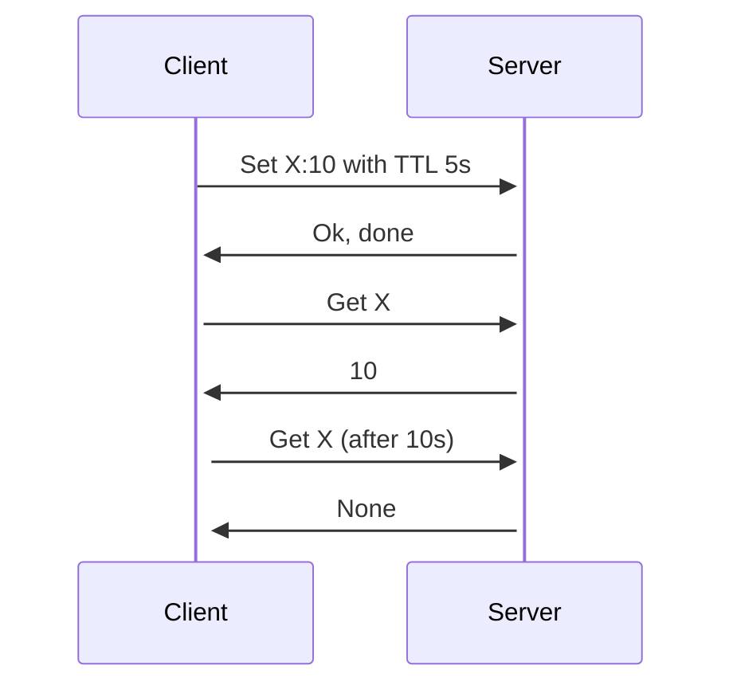

# umd

In memory database for linux only. Killer feature, it is using io_uring.

## Development

If you are not on linux you can use the docker image to build and run the tests.

```zsh
make build-docker
make run-docker
```

```zsh
cargo run
```

#### Testing with curl
    
```zsh
curl --data "value" localhost:9999/key  # set
curl localhost:9999/key                 # get
curl -X POST localhost:9999/key         # del
```

## Architecture

### Engine

### TTL (Time to live)

For now the only implementation is lazy TTL, this means that the key will be deleted only when it is accessed.

