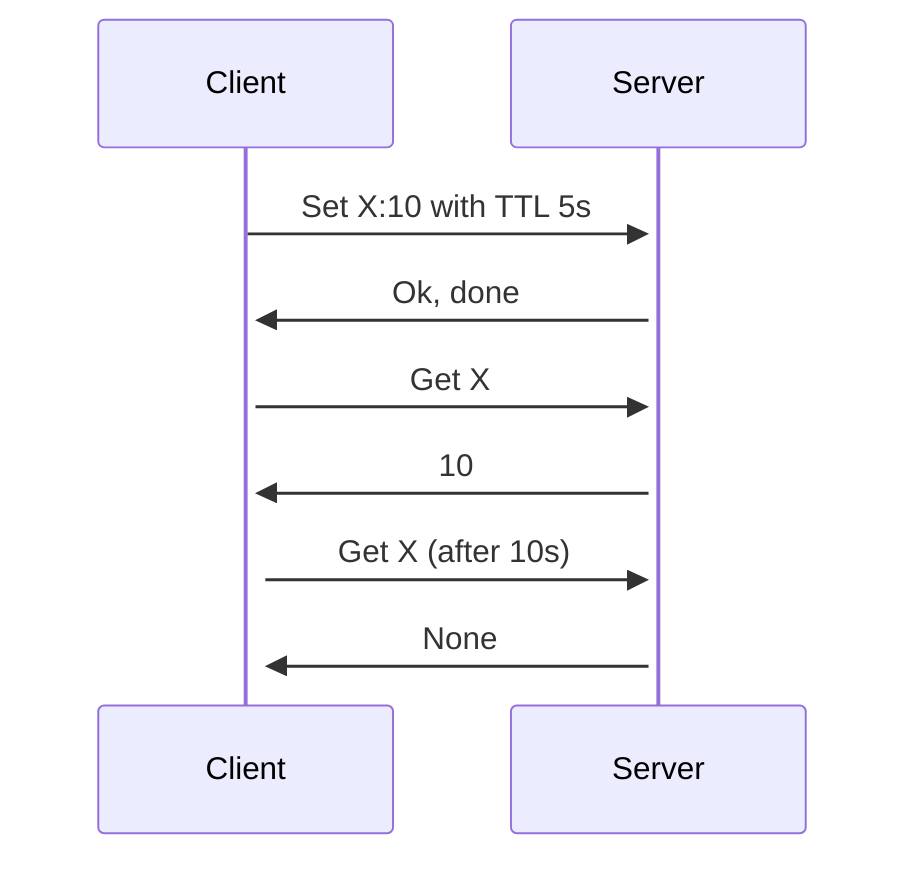

# umd

In memory database for linux only. Killer feature, it is using io_uring.

## Development

If you are not on linux you can use the docker image to build and run the tests.

```zsh
make build-docker
make run-docker
```

```zsh
cargo run
```

## Test

It is possibile using redis client or redis protocol for testing.
In benchmark for example we used `redis-benchmark`, but the plan is to working on custom protocol and better client.

#### Testing with curl

With curl only few commands are supported and the plan is to support the very foundamentals commands and retrieve stats.

```zsh
curl --data "value" localhost:9999/key          # set
curl --data "value EX 10" localhost:9999/key    # set with TTL 10s
curl localhost:9999/key                         # get
curl -X POST localhost:9999/key                 # del
```

## Architecture

### Engine

### TTL (Time to live)

For now the only implementation is lazy TTL, this means that the key will be deleted only when it is accessed.

