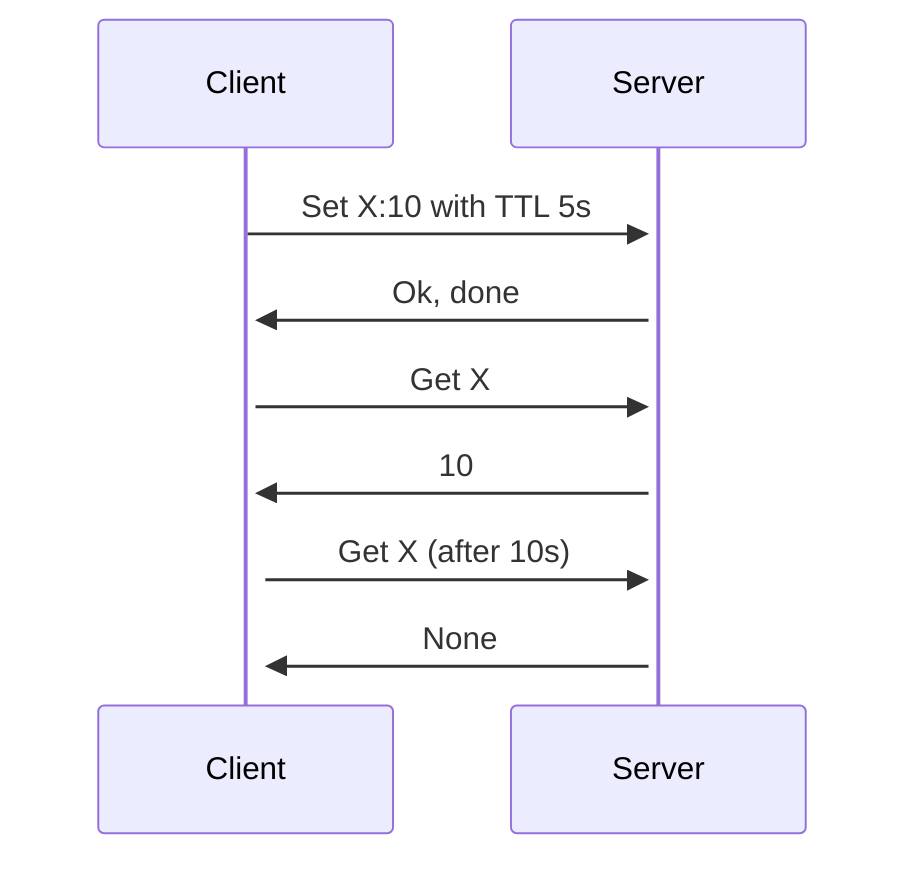

# TTL (Time to live)

At code level it is designed with a simple map in the db engine that stores the key and the time when it will be deleted,
when the key is accessed it is checked if the time has passed and if so it is deleted.

Copy this on [mermaid live editor](https://mermaid.live) to see the diagram.
